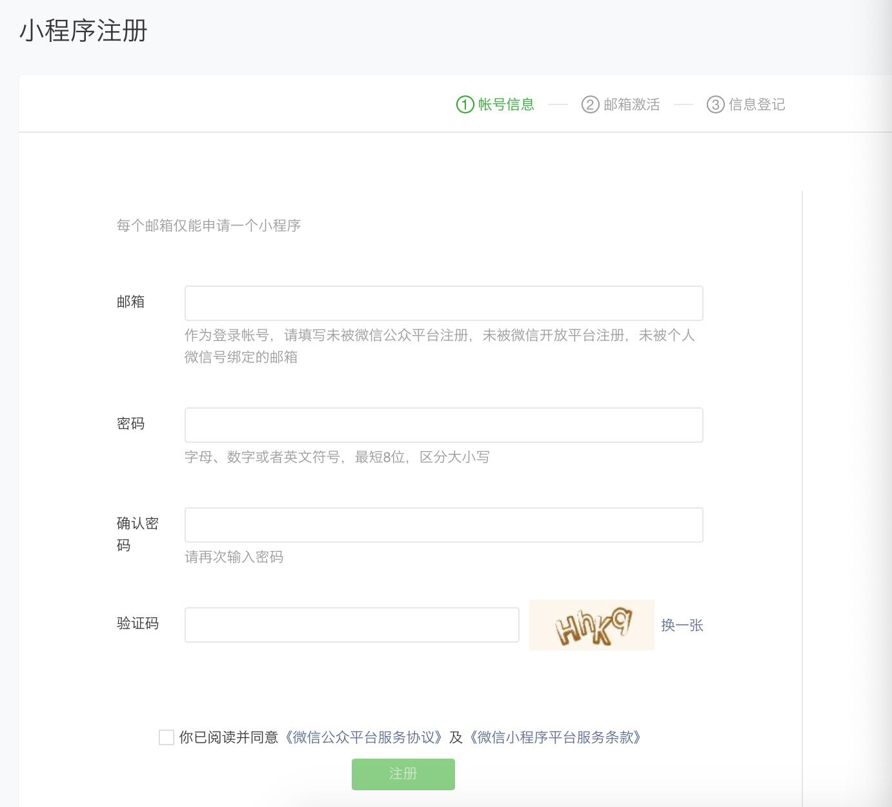
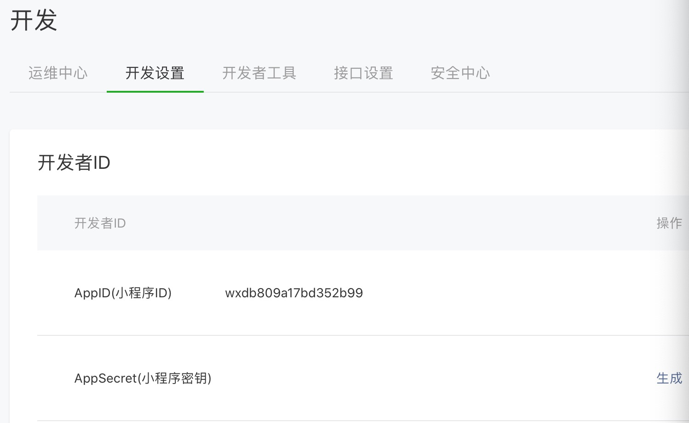
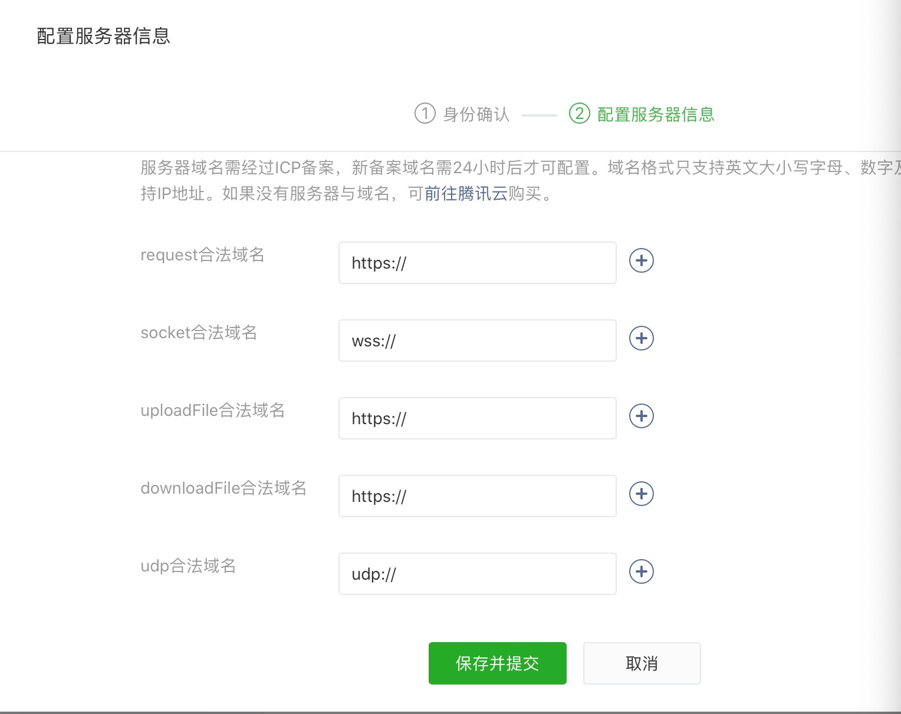
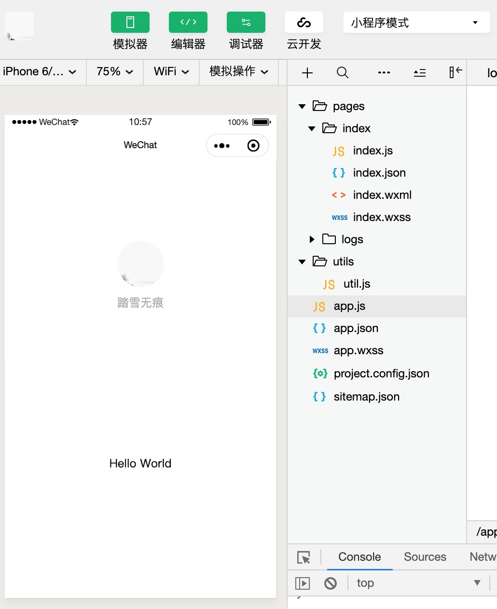
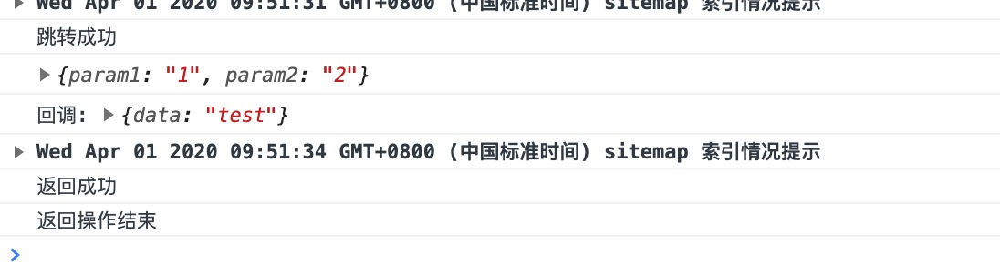
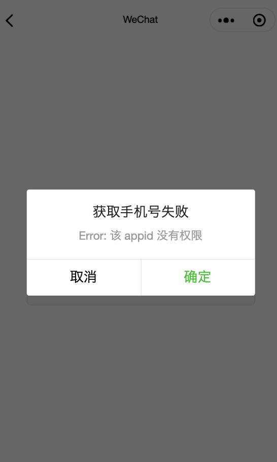

[TOC]

### 第一章:为什么会有小程序

#### 小程序起源

- 小程序是一种全新的连接用户与服务的方式，它可以在微信内被便捷地获取和传播，同时具有出色的使用体验。
- 小程序之前，微信内 **UIWebView/WKWebView** 与原生交互依赖 **JS-SDK**，开放了拍摄、录音、语音识别、二维码、地图、支付、分享、卡券等几十个API。给所有的 Web 开发者打开了一扇全新的窗户，让所有开发者都可以使用到微信的原生能力，去完成一些之前做不到或者难以做到的事情，具体应用:公众号
- JS-SDK 解决了移动网页能力不足的问题，通过暴露微信的接口使得 Web 开发者能够拥有更多的能力，然而在更多的能力之外，JS-SDK 的模式并没有解决使用移动网页遇到的体验不良的问题。用户在访问网页的时候，在浏览器开始显示之前都会有一个的白屏过程，在移动端，受限于设备性能和网络速度，白屏会更加明显。
- 个人认为受束于目前 Web技术 发展，微信对网页的优化基本做到极致，网页的体验问题仍然会长期存在，此时要想从根本上显著提升用户体验，迫切需要一种全新的系统，对新的系统需要:
  1. 快速加载
  2. 更多的原生能力，微信原生数据
  3. 接近原生的体验
  4. 对开发者简单，能快速开发

#### 小程序和普通网页的区别

- 小程序的主要开发语言是 JavaScript ，和普通的Web开发有很大相似性，这样也是为了使用web开发者生态，web开发者开发小程序很容易上手(数据是 JavaScript，界面类 HTML，布局CSS)

- 但小程序和普通网页也有很大区别: 在小程序中**界面渲染**和**数据脚本**是在不同的线程，逻辑层和渲染层是分开的

  | 运行环境         | 逻辑层         | 渲染层              |
  | ---------------- | -------------- | ------------------- |
  | iOS              | JavaScriptCore | UIWebView/WkWebview |
  | Android          | V8             | chromium定制内核    |
  | 小程序开发者工具 | NWJS           | Chrome WebView      |


### 第二章:账号注册以及配置

#### 账号

- 小程序账号区分 **个人账号** 、 **企业账号**、**政府**、**媒体**、**组织**，企业账号比个人账号有更多的微信原生能力，比如**获取用户手机号**，企业账号才有权限获取等等

- 除个人账号无需认证外，其他账号类型均需认证

- 个人主体小程序最多可绑定5个开发者，10个体验者，未认证的组织类型小程序最多可绑定10个开发者，20个体验者，已认证的小程序最多可绑定20个开发者，40个体验者。

- 一个小程序账号目前只能开发一个小程序

  [小程序注册](https://mp.weixin.qq.com/wxopen/waregister?action=step1&token=&lang=zh_CN)

  


#### 账号配置

- 登录 小程序后台，我们可以在菜单 “开发”-“开发设置” 看到小程序的 **AppID** 以及 **AppSecret**




- 进一步需要配置服务器域名，小程序内网络请求只接受在管理后台配置的域名，可配置多个域名

  


配置域名之后就可以进行小程序开发了


### 第三章:初识小程序

#### 小程序代码构成

- 初始化项目之后的代码目录如下:




####1.工具配置 project.config.json

对开发工具的个性化配置，例如界面颜色、编译配置等等，当你换了另外一台电脑重新安装工具的时候，无需再重新配置

```json
{
	"description": "项目配置文件",
	"packOptions": {
		"ignore": []
	},
	"setting": {
		"urlCheck": true,
		"es6": true,
		"postcss": true,
		"minified": true,
		"newFeature": true,
		"autoAudits": false,
		"coverView": true
	},
	"compileType": "miniprogram",
	"libVersion": "2.10.4",
	"appid": "wxdb809a17bd352b99",
	"projectname": "mini",
	"debugOptions": {
		"hidedInDevtools": []
	},
	"isGameTourist": false,
	"simulatorType": "wechat",
	"simulatorPluginLibVersion": {},
	"condition": {
		"search": {
			"current": -1,
			"list": []
		},
		"conversation": {
			"current": -1,
			"list": []
		},
		"game": {
			"currentL": -1,
			"list": []
		},
		"miniprogram": {
			"current": -1,
			"list": []
		}
	}
}
```


####2.小程序全局配置 app.json

包括了小程序的所有页面路径、界面表现、网络超时时间、底部 tab 、UI风格的版本。(小程序的整体风格)

```json
{
  "pages": [
    "pages/index/index",
    "pages/logs/logs"
  ],
  "window": {
    "backgroundTextStyle": "light",
    "navigationBarBackgroundColor": "#fff",
    "navigationBarTitleText": "WeChat",
    "navigationBarTextStyle": "black"
  },
  "tabBar": {
    "list": [{
      "pagePath": "pages/index/index",
      "text": "首页"
    }, {
      "pagePath": "pages/logs/index",
      "text": "日志"
    }]
  },
  "style": "v2",
  "networkTimeout": {
    "request": 10000,
    "downloadFile": 10000
  },
  "debug": true,
  "navigateToMiniProgramAppIdList": [
    "wxe5f52902cf4de896"
  ]
}
```

 	 **pages** 字段用于描述当前小程序所有页面路径，这是为了让微信客户端知道当前你的小程序页面定义在	哪个目录

1. **window** 字段义小程序所有页面的顶部背景颜色，文字颜色定义等

2. **tabbar** 定义小程序内的tabbar

3. **style** 字段用于使用哪个版本的微信UI风格


####3.页面配置page.json

1. 具体某个页面的单独配置，让开发者可以独立定义每个页面的一些属性，例如刚刚说的顶部颜色、是否允许下拉刷新等等，优先级高于app.json中的window配置项。

2. ```json
    
   {
     "navigationBarBackgroundColor": "#ffffff",
     "navigationBarTextStyle": "black",
     "navigationBarTitleText": "页面标题",
     "backgroundColor": "#eeeeee",
     "backgroundTextStyle": "light"
   }
   
   ```

| 属性                         | 类型     | 默认值   | 说明                                  |
| ---------------------------- | -------- | -------- | ------------------------------------- |
| navigationBarBackgroundColor | HexColor | #ffffff  | 导航栏背景颜色                        |
| navigationBarTextStyle       | string   | white    | 导航栏标题颜色 white/black            |
| navigationBarTitleText       | string   |          | 导航栏标题                            |
| navigationStyle              | string   | default  | 导航栏样式 default/custom(只保留胶囊) |
| backgroundColor              | HexColor | #ffffff  | 窗口背景色                            |
| backgroundTextStyle          | string   | dark     | 下拉loading样式 dark/light            |
| backgroundColorTop           | HexColor | #ffffff  | 顶部窗口颜色，iOS                     |
| backgroundColorBottom        | HexColor | #ffffff  | 底部窗口颜色，iOS                     |
| enablePullDownRefresh        | boolean  | false    | 是否开启下来刷新                      |
| onReachBottomDistance        | number   | 50       | 上拉距离，触发上拉刷新                |
| pageOrientation              | string   | portrait | 屏幕方向 auto,protrait,landscape      |
| disableScroll                | boolean  | false    | 屏幕是否能滚动                        |
| usingComponents              | Object   |          | 使用的自定义组件                      |
| style                        | string   | default  | UI风格 v2                             |


####4.WXML文件

构建页面UI，类似web开发中的HTML角色

```html
<view class="container">
  <view class="userinfo">
    <button wx:if="{{!hasUserInfo && canIUse}}" open-type="getUserInfo" bindgetuserinfo="getUserInfo"> 获取头像昵称 </button>
    <block wx:else>
      <image bindtap="bindViewTap" class="userinfo-avatar" src="{{userInfo.avatarUrl}}" mode="cover"></image>
      <text class="userinfo-nickname">{{userInfo.nickName}}</text>
    </block>
  </view>
  <view class="usermotto">
    <text class="user-motto">{{motto}}</text>
  </view>
</view>
```

和HTML非常类似，由标签、属性构成，但也有些区别

- 标签名不完全和HTML一致，例如`view`、`buttom`、`text`、`block`等等，这些标签就是小程序给开发者包装好的基本能力，我们还提供了地图、视频、音频等等组件能力。

- 有一些特别的属性 `wx:if`、`wx:for`等等

  小程序使用了类似 Vue、和React Native 的MVVM 开发模式，数据和界面渲染分离，例如:

  ```js
  data:{
      msg:"hello world"
  }
  
  clickMe(){
  	this.setData({
          msg:"hello Topabnd"
  	})
      或者,由于界面渲染是异步的，可在渲染完成之后，如果需要再触发其他行为
      this.setData({
          msg:"hello Topband"
      },()=>{
        consoloe.log("涉及到的界面，渲染完成之后的回调")  
  	})
      
  }
  ```

  ```html
  <text>{{msg}}</text>
  <button bindtap="clickMe">点击我</button>
  ```


####5.WXSS样式文件

`WXSS` 具有 `CSS` 大部分的特性，小程序在 `WXSS` 也做了一些扩充和修改

1. 新增了尺寸单位。在写 `CSS` 样式时，开发者需要考虑到手机设备的屏幕会有不同的宽度和设备像素比，采用一些技巧来换算一些像素单位。`WXSS` 在底层支持新的尺寸单位 `rpx` ，开发者可以免去换算的烦恼，只要交给小程序底层来换算即可，由于换算采用的浮点数运算，所以运算结果会和预期结果有一点点偏差。
2. 提供了全局的样式和局部样式。和前边 `app.json`, `page.json` 的概念相同，你可以写一个 `app.wxss` 作为全局样式，会作用于当前小程序的所有页面，局部页面样式 `page.wxss` 仅对当前页面生效。
3. 小程序布局可以使用flexbox布局，但默认是普通css布局，需要开启flexbox 布局 `display:flex`, 和ReactNative不同的是，默认是横向布局，有些关键属性写法也有区别

```css
.box {
  display: flex; // 开启flexbox 布局，在开发中最好都是用flexbox布局
  flex-direction: column;
  justify-content: center;
  align-items: center;
  min-height: 100%;
  width: 100%
}
```


#### 6.sitemap.json 文件

配置小程序或者单个页面是否能被微信搜索爬取，也可以在管理后台页面收录开关来配置其小程序页面是否允许微信索引，当开发者允许微信索引时，微信会通过爬虫的形式，为小程序的页面内容建立索引。当用户的搜索词条触发该索引时，小程序的页面将可能展示在搜索结果中.

```
{
  "rules": [{
  "action": "allow",
  "page": "*"	//所有的页面都会被微信索引
  }]
}

--------------------------------------------------

{
  "rules":[{
    "action": "disallow",
    "page": "path/to/page" //仅page页面不会被微信索引
  }]
}

--------------------------------------------------

{
  "rules":[{
    "action": "allow",
    "page": "path/to/page"
  }, {
    "action": "disallow",
    "page": "*"
  }]
}

```


#### 7.app.js文件

此时小程序入口文件，类似iOS的 Appdelegate文件，在此文件中注册小程序实例，绑定生命周期回调函数、错误监听等等

```
App({
  onLaunch (options) {
    // Do something initial when launch.
  },
  onShow (options) {
    // Do something when show.
  },
  onHide () {
    // Do something when hide.
  },
  onError (msg) {
    console.log(msg)
  },
  onPageNotFound(res){
  	//页面不存在监听函数
  	wx.redirectTo({
      url: 'pages/...'
    })
  }
  
  //还可以添加任意变量或者函数，用 this 可以访问
 
  globalData: 'I am global data'
})
```

整个小程序只有一个 App 实例，是全部页面共享的。可以通过 `getApp` 方法获取到全局唯一的 App 实例，获取App上的数据或调用开发者注册在 `App` 上的函数

```js
const appInstance = getApp()
console.log(appInstance.globalData)
```


### 第四章:小程序页面

一个小程序页面由四个文件组成，在创建页面的时候会自动生成四个文件，同名但后缀不同，生成后不要单独改动某一个文件名

| 文件类型  | 作用     |
| --------- | -------- |
| page.js   | 页面逻辑 |
| page.wxml | 页面结构 |
| page.json | 页面配置 |
| page.wxss | 页面样式 |


#### 1.注册页面

​	默认系统生成的页面使用 page()进行构造，完全满足一般需求开发

```js
Page({

  /**
   * 页面的初始数据
   */
  data: {
	msg:'xxxxx'
  },

  /**
   * 生命周期函数--监听页面加载
   */
  onLoad: function (options) {

  },

  /**
   * 生命周期函数--监听页面初次渲染完成
   */
  onReady: function () {

  },

  /**
   * 生命周期函数--监听页面显示
   */
  onShow: function () {

  },

  /**
   * 生命周期函数--监听页面隐藏
   */
  onHide: function () {

  },

  /**
   * 生命周期函数--监听页面卸载
   */
  onUnload: function () {

  },

  /**
   * 页面相关事件处理函数--监听用户下拉动作,对应的 page.json 的 enablePullDownRefresh = true
   */
  onPullDownRefresh: function () {
	//
  },

  /**
   * 页面上拉触底事件的处理函数
   */
  onReachBottom: function () {

  },
  onPageScroll: function() {
    // 页面滚动时执行
  },
  onResize: function() {
    // 页面尺寸变化时执行,横屏竖屏切换
  },
  onTabItemTap(item) {
    // tab 点击时执行,在tab的一级页面才会触发
    console.log(item.index)
    console.log(item.pagePath)
    console.log(item.text)
  },
  /**
   * 用户点击右上角分享
   */
  onShareAppMessage: function () {

  },
  
  freefunction(){
	//自定义函数
  },
  
  /**
  * 自由数据
  **/
  customData:{
  	message:"topband"
  }

```

​	`Page` 构造器适用于简单的页面，但对于复杂的页面，此时使用Component构造页面，把一个页面当做一个组件， 方法需要放在 `methods: { }` 里面，对应 json 文件中包含 `usingComponents` 定义段

```js
Component({
    
  properties: {
    myProperty: { // 属性名
      type: String,
      value: ''
    },
    myProperty2: String // 简化的定义方式
  },
    
  data: {
    text: "This is page data."
  },
  methods: {
    onLoad: function(options) {
      // 页面创建时执行
    },
    onPullDownRefresh: function() {
      // 下拉刷新时执行
    }
  }
})
```


#### 2.页面事件使用

- wxml文件

  ```html
  
  <button class="button" bindtap="buttonClick" id="1234567890" data-name="张三">点击</button>
  
  ```

- js 文件

  ```
  Page({
  
      buttonClick(event){
      	console.log(event)
  	}
  })
  ```

- 输出

  ```json
  {"type":"tap",
   "timeStamp":3032,
   "target":{"id":"1234567890",
             "offsetLeft":38,
             "offsetTop":266,
             "dataset":{"name":"张三"}
            },
   "currentTarget":{"id":"1234567890",
                    "offsetLeft":38,
                    "offsetTop":266,
                    "dataset":{"name":"张三"}
                   },
   "mark":{},
   "detail":{"x":229.1354217529297,"y":296.28125},
   "touches":[
       {
           "identifier":0,
           "pageX":230.00001525878906,
           "pageY":296,
           "clientX":230.00001525878906,
           "clientY":296,
           "force":1
       }
   ],
   "changedTouches":[
       {
           "identifier":0,
           "pageX":230.00001525878906,
           "pageY":296,
           "clientX":230.00001525878906,
           "clientY":296,
           "force":1
       }
   ],
   "mut":false,
   "_userTap":true
  }
  ```


#### 3.页面跳转

小程序内页面跳转常用api：`wx.navigateTo`、`wx.navigateBack`、`wx.switchTab`、`wx.reLaunch`、`wx.redirectTo`

**说明:** 小程序中页面栈最多十层。

以 index页面跳转 root页面为栗:

```js
index.js :

Page({
    
    pushNextPage(){

		wx.navigateTo({
      		url: '../root/root?param1=1&param2=2',
      		events:{
        		callback(param){
          			console.log('回调:',param)
        		}
      		},
      		success(res){
        		console.log('跳转成功')
      		},
      		fail(error){
				console.log('跳转失败')
      		},
      		complete(res){
        		console.log('跳转完成')
      		}
    	})
	}
})

```

```
root.js ：

Page({
  data: {

  },
  onLoad: function (options) {
    console.log(options)
  },
  
  buttonClick(event){
  
    const eventChannel = this.getOpenerEventChannel()
    eventChannel.emit('callback', { data: 'test' });
    
    wx.navigateBack({
      delta:1, //返回的页面数，如果 delta 大于现有页面数，则返回到首页。
      success(res){
        console.log('返回成功')
      },
      fail(error){
        console.log('返回失败')
      },
      complete(res){
        console.log('返回操作结束')
      }
    })
  }
})

```




### 第五章:网络部分

#### 1.服务器域名配置

- 小程序需要先在管理后台配置通讯域名，线上只有配置的域名才能在小程序内进行网络通信，适用所有类型的通信: HTTPS，文件上传下载，WebSocket以及UDP通信。
- 域名不能使用IP地址，不支持hppt域名
- 域名必须经过ICP备案
- 域名不能是 `api.weixin.qq.com`
- 每个接口，最多配置20个域名
- 在开发阶段，小程序开发工具可关闭域名校验已经HTTPS证书

#### 2.网络请求

```js
const requestTask = wx.request({
      url: '',
      data:{
		//请求参数
      },
      header:{
        'content-type': 'application/json' // 默认值
      },
      timeout:15000,
      method:"GET",
      dataType:'json',
      responseType:'text',
      enableCache:false,
      success(res){

      },
      fail(error){

      },
      complete(res){

      }
    })

requestTask.abort()

```

| 属性         | 类型          | 默认值 | 必须 | 说明                                                         |
| ------------ | ------------- | ------ | ---- | ------------------------------------------------------------ |
| url          | string        |        | 是   | 服务器地址                                                   |
| data         | Object/string |        | 否   | 请求参数                                                     |
| header       | Object        |        | 否   | 请求header                                                   |
| timeout      | number        |        | 否   | 毫秒单位,优先级高于json配置                                  |
| method       | string        | GET    | 否   | OPTIONS，GET，HEAD，POST，PUT，DELETE，TRACE，CONNECT        |
| dataType     | string        | json   | 否   | 返回的数据格式                                               |
| responseType | string        | text   | 否   | 响应的数据类型                                               |
| enableCache  | Bool          | false  | 否   | 缓存                                                         |
| success      | function      |        | 否   | 回调，内容包含: data , statusCode , header , cookies , profile(网络请求过程中一些关键时间点的耗时信息) |
| fail         | function      |        | 否   | 回调                                                         |
| comple       | function      |        | 否   | 回调                                                         |


- 网络请求最大超时时间 60s，在app.json 或者 page.json 均可设置
- 网络请求的 `referer` header 不可设置。其格式固定为 `https://servicewechat.com/{appid}/{version}/page-frame.html`，其中 `{appid}` 为小程序的 appid，`{version}` 为小程序的版本号，版本号为 `0` 表示为开发版、体验版以及审核版本，版本号为 `devtools` 表示为开发者工具，其余为正式版本；
- `wx.request`、`wx.uploadFile`、`wx.downloadFile` 的最大并发限制是 **10** 个；
- `wx.downloadFile` 单次下载允许的最大文件为 50MB，可监听下载进度
- 小程序进入后台运行后，如果 **5s** 内网络请求没有结束，会回调错误信息 `fail interrupted`；


### 第六章:小程序登录机制以及开放能力


####1.登录机制

- 小程序可以通过微信官方提供的登录能力方便地获取微信提供的用户身份标识，快速建立小程序内的用户体系


- 授权

  有部分接口需要经过用户授权同意才能调用, 这些接口区分不同的类型，称为 **scope** ，栗子:

  用户信息 	—— scope.scope.userInfo

  地理位置		—— scope.userLocation

  1. 用户第一次授权会有弹框
  2. 用户已经授权，再调用相关接口不会再有弹框
  3. 如果用户已拒绝，并不会再有弹框，相关接口直接返回fail
  4. 相关授权开关可在右上角胶囊  `...` --> 设置 中查看并设置 ，或者开发者调用 `wx.openSetting` 引导用户去设置，个人感觉和Apple的相关机制类似
  5. 一旦用户明确同意或拒绝过授权，其授权关系会记录在后台，直到用户主动删除小程序
  6. 在真正需要使用授权接口时，才向用户发起授权申请，并在授权申请中说明清楚要使用该功能的理由

  | scope                        | 对应接口                                                     | 说明           |
  | ---------------------------- | ------------------------------------------------------------ | -------------- |
  | scope.userInfo               | `wx.getUserInfo`                                             | 获取用户信息   |
  | scope.userLocation           | `wx.getLocation`、`wx.chooseLocation`                        | 地理位置       |
  | scope.userLocationBackground | `wx.startLocationUpdateBackground`                           | 后台定位       |
  | scope.address                | `wx.chooseAddress`                                           | 通讯地址       |
  | scope.invoiceTitle           | `wx.chooseInvoiceTitle`                                      | 发票抬头       |
  | scope.invoice                | `wx.chooseInvoice`                                           | 获取发票       |
  | scope.werun                  | `wx.getWeRunData`                                            | 微信运动步数   |
  | scope.record                 | `wx.startRecord`                                             | 录音功能       |
  | scope.writePhotosAlbum       | `wx.saveImageToPhotosAlbum`<br />`wx.saveVideoToPhotosAlbum` | 保存图片和视频 |
  | scope.camera                 | camera 组件                                                  | 摄像头         |

- 手机号授权

  1. 个人账号没有获取手机号权限
  2. 需要将  **button** 组件 `open-type` 的值设置为 `getPhoneNumber`，当用户点击并同意之后，可以通过 `bindgetphonenumber` 事件回调获取到微信服务器返回的加密数据， 然后在第三方服务端结合 `session_key` 以及 `app_id` 进行解密获取手机号

  ```html
  <button class="button" open-type="getPhoneNumber" bindgetphonenumber="fetchPhoneNum">获取手机号</button>
  ```

  ```js
  Page({
    fetchPhoneNum (e) {
      console.log(e.detail.errMsg) 包括敏感数据在内的完整用户信息的加密数据
      console.log(e.detail.iv) //加密算法的初始向量
      console.log(e.detail.encryptedData) //包括敏感数据在内的完整用户信息的加密数据
    }
  })
  ```

  解密之后的数据:

  ```json
  {
      "phoneNumber": "13580006666",
      "purePhoneNumber": "13580006666",
      "countryCode": "86",
      "watermark":
      {
          "appid":"APPID",
          "timestamp": TIMESTAMP
      }
  }
  ```

  以下是个人账号没有权限获取手机号表现:

  


#### 2.开放能力

- 生物认证: **指纹识别**，**人脸识别**，**声纹识别**(暂未支持)

```js
wx.startSoterAuthentication({
      challenge: 'challenge',
      requestAuthModes: ["fingerPrint"],//fingerPrint,facial,speech
      success(res){

      },
      fail(error){

      },
      complete(res){
        
      }
    })


```

- 小程序内打开App

  此功能需要用户主动触发才能打开 APP，所以不由 API 来调用，需要用 `open-type` 的值设置为 `launchApp` 的 **button**组件的点击来触发

  一个小程序只能打开一个App

  小程序:

  ```
  <button open-type="launchApp" app-parameter="wechat">打开APP</button>
  ```

  App原生端

  ​	引入openSDK，iOS需要把小程序 appid 设置为 schemes

- 还有其他开放能力: 订阅消息，卡券，微信物流，广告等


### 第七章:常用组件以及第三方组件


#### 1.常用组件简介

| 组件名      | 说明                       |
| ----------- | -------------------------- |
| text        | 文本  —— UILabel           |
| image       | 图片  —— UIImageView       |
| icon        | 微信系统图片               |
| button      | 按钮  —— UIButton          |
| view        | 空白视图  ——— UIview       |
| progress    | 进度条 —— UIProgressView   |
| input       | 输入框 ——— UITextField     |
| checkbox    | 多选器                     |
| radio       | 单选器                     |
| picker      | 选择器  ——  UIPickerView   |
| slider      | 滑杆  ———  UISlider        |
| switch      | 开关  ———— UISwitch        |
| textarea    | 多行输入框,类似 UITextView |
| scroll-view | scrollView                 |
| editor      | 富文本编辑器               |
| form        | 表单                       |
| audio       | 音频                       |
| camera      | 系统相机                   |
| live-player | 实时视频播放(直播拉流)     |
| live-pusher | 实时视频录制(直播推流)     |
| video       | 视频                       |
| map         | 地图                       |
| canvas      | 画布                       |
| web-view    | 加载网页                   |


```html
<view class="box">

<button class="button" open-type="getPhoneNumber" bindgetphonenumber="fetchPhoneNum">获取手机号</button>

<button class="button" bindtap="gestureAuth">指纹认证</button>
    
<button class="button" bindtap="openApp" open-type="launchApp">打开App</button>
    
<text>文本</text>
    
<input />
    
<icon type="success"></icon>
    
<editor />
    
<map/>
    
</view>

```


#### 2.使用第三方

​	知名UI库  ： **weui**，**vant-weapp**

- 在项目根目录创建package.json 文件

  ```js
  npm init 
  
  依次输入即可完成创建package文件
  ```

- 之后安装第三方

  ```js
  npm install vant-weapp
  ```

- 构建

  ```
  开发工具菜单栏 ---- 工具 ---- 构建npm  
  ```

- 之后即可正常使用第三方组件


